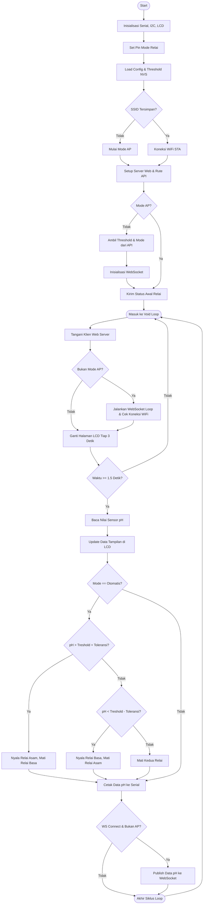

# Flowchart Sistem Hidroponik

Berikut adalah *flowchart* berdasarkan alur kerja program ESP32 yang kamu berikan, dengan mengabaikan bagian kalibrasi:

```mermaid
flowchart TD
    A([Start]) --> B[Inisialisasi Serial, I2C, LCD]
    B --> C[Set Pin Mode Relai]
    C --> D[Load Config & Threshold NVS]
    D --> E{SSID Tersimpan?}
    E -- Tidak --> F[Mulai Mode AP]
    E -- Ya --> G[Koneksi WiFi STA]
    F --> H[Setup Server Web & Rute API]
    G --> H
    H --> I{Mode AP?}
    I -- Tidak --> J[Ambil Threshold & Mode dari API]
    J --> K[Inisialisasi WebSocket]
    K --> L
    I -- Ya --> L[Kirim Status Awal Relai]
    L --> M([Masuk ke Void Loop])

    M --> N[Tangani Klien Web Server]
    N --> O{Bukan Mode AP?}
    O -- Ya --> P[Jalankan WebSocket Loop & Cek Koneksi WiFi]
    O -- Tidak --> Q[Ganti Halaman LCD Tiap 3 Detik]
    P --> Q

    Q --> R{Waktu >= 1.5 Detik?}
    R -- Tidak --> M
    R -- Ya --> S[Baca Nilai Sensor pH]
    S --> T[Update Data Tampilan di LCD]
    T --> U{Mode == Otomatis?}
    U -- Ya --> V{pH > Treshold + Toleransi?}
    V -- Ya --> W[Nyala Relai Asam, Mati Relai Basa]
    V -- Tidak --> X{pH < Treshold - Toleransi?}
    X -- Ya --> Y[Nyala Relai Basa, Mati Relai Asam]
    X -- Tidak --> Z[Mati Kedua Relai]
    
    W --> AA
    Y --> AA
    Z --> AA
    U -- Tidak --> AA[Cetak Data pH ke Serial]
    
    AA --> AB{WS Connect & Bukan AP?}
    AB -- Ya --> AC[Publish Data pH ke WebSocket]
    AB -- Tidak --> AD([Akhir Siklus Loop])
    AC --> AD
    AD --> M
```
